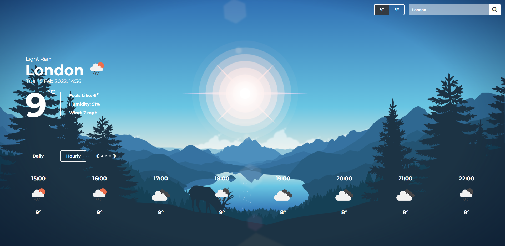

A weather app using the Open Weather Map API.

## Weather App
- Live Demo: https://aidenm99.github.io/Weather-App/

### Features

- Search for a location by city name
- Display the daily forecast for the next 7 days for the chosen location
- Display the hourly forecast for the next 24 hours for the chosen location
- Show the current time and date for the target location
- A description of the forecast and unique weather symbols to match

