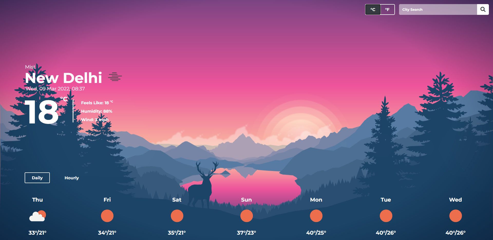
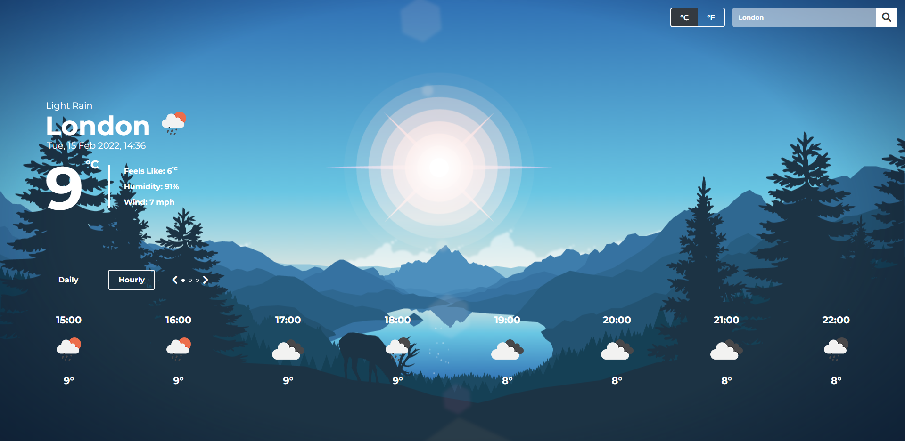
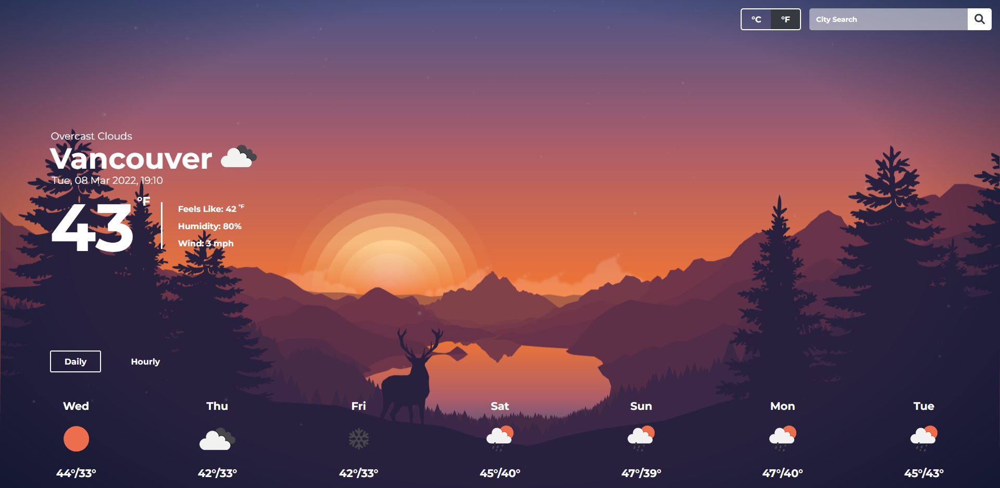
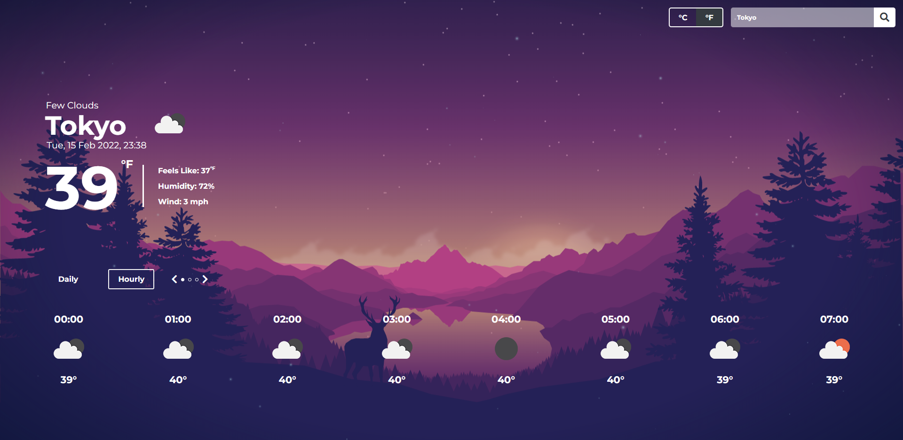
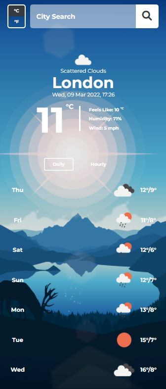

## Weather App
A weather app made using the Open Weather Map API.

Live Demo: https://aidenm99.github.io/Weather-App/

## Technologies Used
This project was built using:
- HTML5
- CSS
- JavaScript
- Webpack

## Features
- Search for a location by city name
- Display the daily forecast for the next 7 days for the chosen location
- Display the hourly forecast for the next 24 hours for the chosen location
- Show the current time and date for the target location
- A description of the forecast and unique weather symbols to match
- Switch between Celsius (C°) and Fahrenheit (F°)
- Multiple backgrounds depending on the time of day in a given location

## Screenshots
Dawn, daily forecast, celsius

Midday, hourly forecast, celsius

Dusk, daily forecast, farenheit

Night, hourly forecast, farenheit

Mobile view

